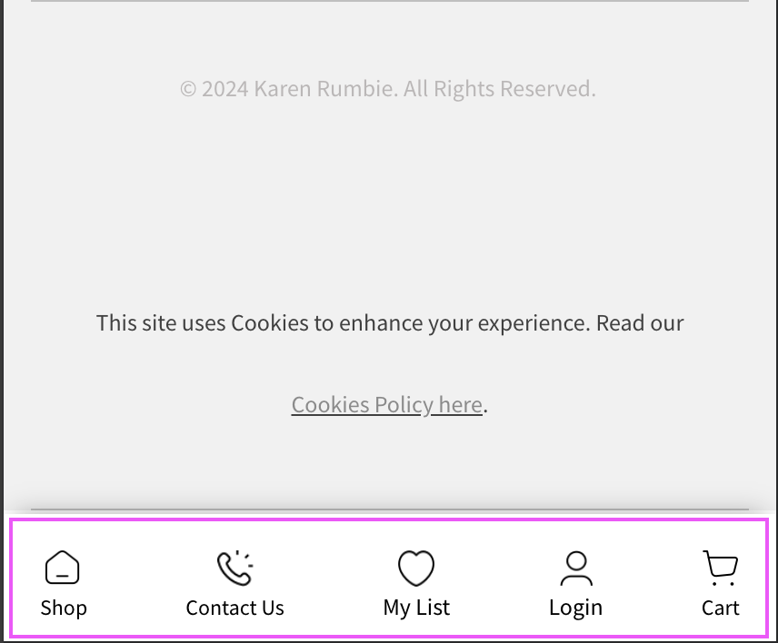
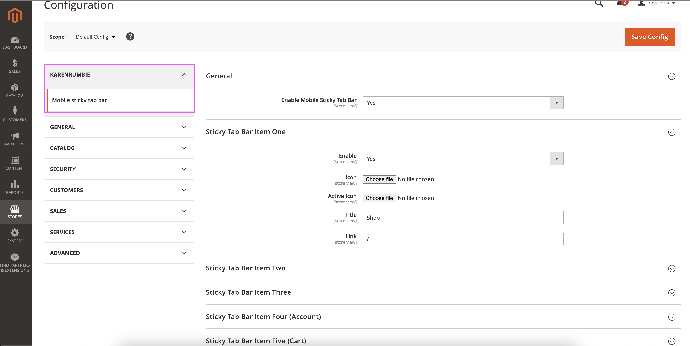

# KarenRumbie Mobile Stick Tab bar module

`karenrumbie/stickytabbar`

- [KarenRumbie Mobile Stick Tab bar](#karenrumbie-stickytabbar)
    - [Main Functionalities](#main-functionalities)
    - [Installation](#installation)
    - [Configuration](#configuration)

## Main Functionalities

Brief description of what the module does.

```bash
A module to manage the sticky tab bar displayed at the bottom of each screen for MOBILE ONLY.
```

## Installation

Add the following to your main composer.json file:

```json
    "repositories": [
        ...
        {
            "type": "vcs",
            "url": "https://github.com/KarenRumbidzai/mobile-stickytabbar.git"
        }
    ]
```

Next, install the module via composer as follows:

```bash
$ composer require karenrumbie/stickytabbar:1.0.0
$ composer update -vvv
```

After the composer installation has finished, activate the module by running the following commands from your Magento 2 root directory:

```bash
$ php bin/magento module:enable KarenRumbie_StickyTabBar
$ php bin/magento setup:upgrade;
$ php bin/magento di:compile;
```

## Configuration

Configuration needed for module to work.

```bash
Module can be enabled/disabled in admin. It display under Stores > Configuration > KarenRumbie > Mobile sticky tab bar.

PS: I added the iconsFolder in the event you want to upload similar icons in demo in the backend.
```


